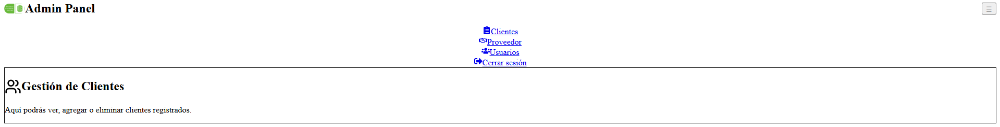

# 🧑‍💻 Panel Administrativo - React + Vite

Este proyecto es un **panel administrativo web** desarrollado con **React**, **Vite** y **React Router**, orientado a la gestión de usuarios, clientes y proveedores. Fue creado como parte de un taller para la Escuela de Ingeniería de Sistemas e Informática (I Semestre 2025) con el profesor **Carlos Adolfo Beltrán Castro**.

## 🚀 Tecnologías usadas

- ⚛️ React (con React Hooks)
- ⚡ Vite como bundler
- 🎨 TailwindCSS para estilos rápidos y modernos
- 🔄 React Router DOM para navegación SPA
- 📦 Icons de `react-icons` y `lucide-react`

## 📂 Estructura general

- `Navbar.jsx` – Barra de navegación responsiva
- `Clientes.jsx` – Página principal de gestión de clientes
- `Usuarios.jsx` – Página de usuarios
- `Proveedor.jsx` – Página para proveedores
- `Logout.jsx` – Simulación de cierre de sesión

## 📸 Captura del panel

_A continuación se muestra una captura de la interfaz del panel:_



## 📦 Cómo ejecutar localmente

1. Se clona el repositorio o descarga el ZIP.
2. Abre la carpeta `panel-admin` desde la terminal.
3. Ejecuta los siguientes comandos:

```bash
npm install
npm run dev
